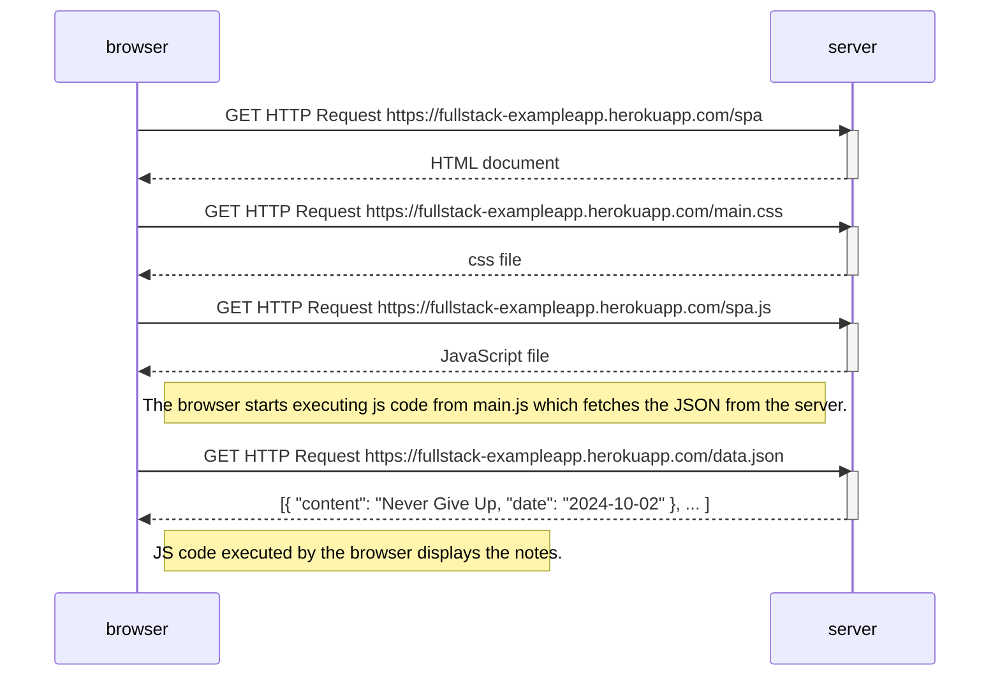

```mermaid
  sequenceDiagram
      participant browser
      participant server

      browser->>server: GET HTTP Request https://fullstack-exampleapp.herokuapp.com/spa
      activate server
      server-->>browser: HTML document
      deactivate server

      browser->>server: GET HTTP Request https://fullstack-exampleapp.herokuapp.com/main.css
      activate server
      server-->>browser: css file
      deactivate server

      browser->>server: GET HTTP Request https://fullstack-exampleapp.herokuapp.com/spa.js
      activate server
      server-->>browser: JavaScript file
      deactivate server

      Note right of browser: The browser starts executing js code from main.js which fetches the JSON from the server.

      browser->>server: GET HTTP Request https://fullstack-exampleapp.herokuapp.com/data.json
      activate server
      server-->>browser: [{ "content": "Never Give Up, "date": "2024-10-02" }, ... ]
      deactivate server

      Note right of browser: JS code executed by the browser displays the notes.
```

